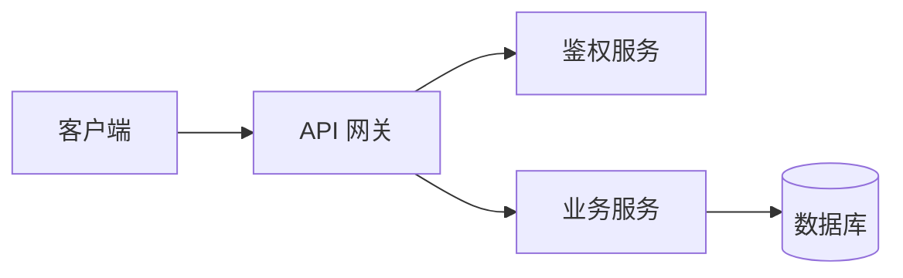
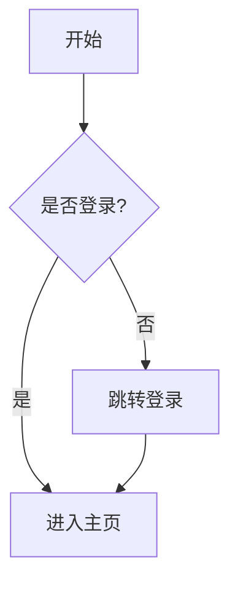
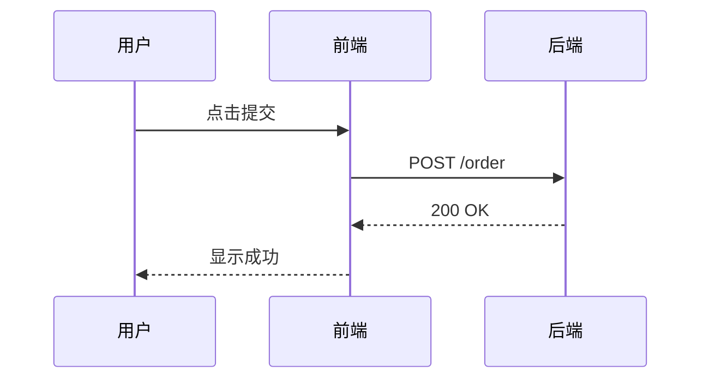
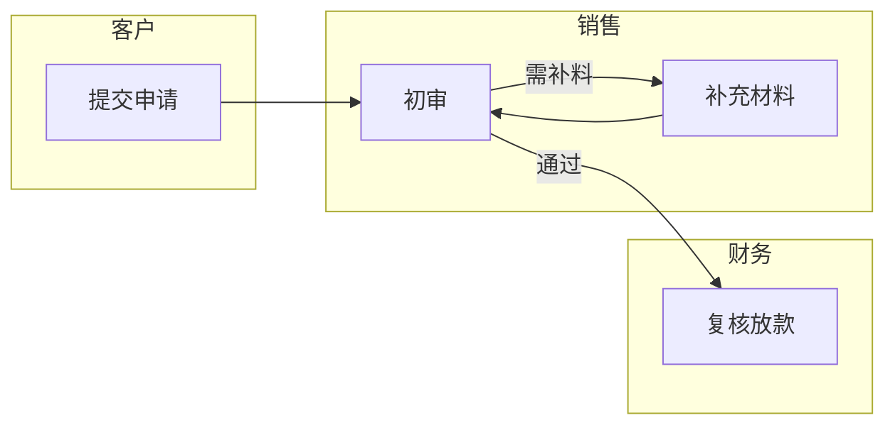
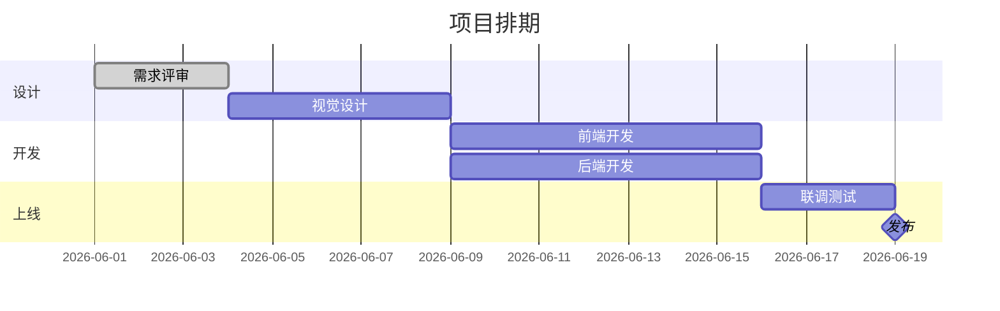

# 图表选型与 Mermaid 指南

> easy-read 在金字塔结构化后，把适合图示的内容画成图。本文件规定：何时画图、选哪种图、怎么写 Mermaid。渲染与内联机制见 `html-generation-guide.md` 的"Mermaid 图表渲染"章节。

## 何时画图 vs 用文字/表格（判断准则）

**默认倾向：主动找图示机会，而不是默认写成段落。** 结构化出骨架后逐节点扫描——只要沾"关系 / 流程 / 结构 / 时序 / 分工"，就优先画图，因为图能比文字**更快**让读者抓住这些结构：

- **关系**：谁依赖谁、谁包含谁 → 架构图
- **顺序/流转**：步骤、分支、状态迁移 → 流程图
- **交互**：多角色之间的消息往返 → 时序图
- **分工**：多个角色/部门各负责流程的一段 → 泳道图
- **时间/排期**：阶段、里程碑、并行任务 → 甘特图

只有以下内容才回退文字 / 表格（这些画图反而更难读）：
- 纯结论或观点 → 用卡片/大标题
- 属性对比（A vs B 的多个维度）→ 对比表格
- 无顺序的清单罗列 → 列表/卡片网格

**底线：图表服务于理解，不为画图而画图——但"不为画图而画图" ≠ "少画图"。** 只对上面三类纯文字场景才不画；只要沾五类结构就画。一段平铺直叙的结论硬画成流程图反而更难读，反过来，一段本质是流程的文字不画图也一样难读。

## 选型映射表

| 内容特征 | 图表类型 | Mermaid 写法 |
|---|---|---|
| 系统组成 / 模块关系 / 层级 | 架构图 | `flowchart` / `graph` |
| 步骤 / 流转 / 决策分支 | 流程图 | `flowchart` |
| 多角色消息交互 | 时序图 | `sequenceDiagram` |
| 多角色分工的流程 | 泳道图 | `flowchart` + `subgraph`（每 subgraph 一条泳道） |
| 任务排期 / 时间线 / 阶段 | 甘特图 | `gantt` |

## 五类图写法

### 架构图（flowchart）

### 流程图（flowchart，含决策）

### 时序图（sequenceDiagram）

### 泳道图（flowchart + subgraph 模拟）

Mermaid 无原生泳道图。用每个 `subgraph` 表示一条泳道（一个角色/部门），区内节点为其负责的步骤，跨区连线表示交接：

### 甘特图（gantt）

## 写图注意事项

- **节点文字精炼**，长句拆成短词；中文节点字号在 `themeVariables.fontSize` 调到可读（≥14px）。
- 一张图只讲一件事；内容多就拆成多张图，配文字小标题。
- 方向：纵向流程用 `TD`/`TB`，横向关系用 `LR`。
- Mermaid 源码里避免用裸 `()` `[]` `{}` 以外的特殊字符做节点名；需要时用引号包裹：`A["含(括号)的文本"]`。

## 内联与配色

渲染、mermaid.min.js 内联（占位符 + python3 注入）、品牌配色（`themeVariables` 用选中 design-md 强调色）的完整规范，见 `html-generation-guide.md` 的"Mermaid 图表渲染"章节。
