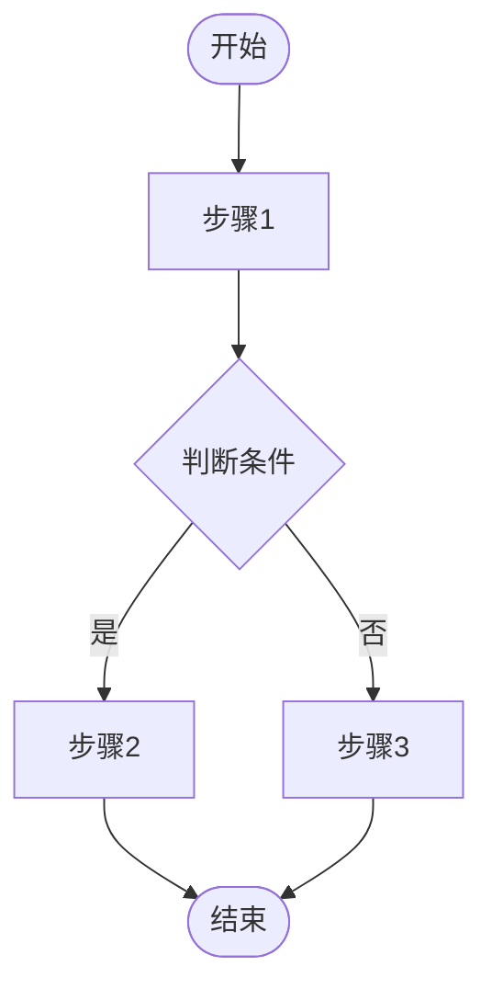
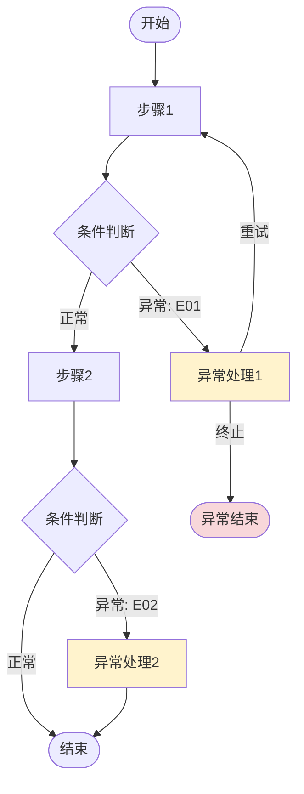

# PRD 需求分析技能

## 定位

本技能聚焦**业务设计**层面，不涉及技术实现。分析过程关注"做什么"和"为什么做"，而非"怎么做"。需要绘制流程图、时序图等图表时，统一使用 **Mermaid** 语法。

本技能设为**手动调用**（`disable-model-invocation: true`），模型不会自动触发。需要时请用 `/prd-analyse:prd-analyse` 调用，上面的 `description` 用于帮助判断何时适合手动启用。

## 输出文件

分析产物写入一个 Markdown 文件，**路径在分析开始时确定，整个流程固定不变**：

- 默认路径：`docs/prd-analyse.md`
- 用户可在启动时指定其他路径（如 `docs/<需求名>-需求分析.md`）
- 同一目录分析多个不同需求时，**务必用不同文件名**，否则会互相覆盖

下文统一用「输出文件」指代这个路径。

## 文件写入机制（读改写，不用 Edit 追加）

每一步的写入采用 **Read 全文 → 拼接新章节 → Write 覆盖**，**不使用 Edit 追加**。原因：Edit 追加要靠文件末尾文本做锚点匹配，而末尾常是动态生成的 Mermaid 图，匹配极易失败或插错位置；读改写每次写回的是完整文档，幂等、可重入、不怕超时重跑。

写入节奏：
1. **初始化**：创建输出文件，写入标题、日期、需求来源、原始需求
2. **每步确认后**：Read 当前文件 → 在末尾拼接本步骤章节 → Write 覆盖
3. **全部完成时**：追加「7. 待确认事项」章节，完成收尾

此外，**每个步骤开始前先 Read 输出文件**，把前序步骤已确认的结果作为本步骤输入，不依赖对话记忆——分步流程可能跨多轮或遭遇上下文压缩，文件是唯一可信来源。

## 待确认事项收集

每个步骤的分析过程中，遇到以下情况时记录为待确认事项：
- 需求描述有歧义，给出了假设但未得到用户确认的点
- 多种合理方案可选，当前选了一种但需要业务方拍板的决策
- 分析中发现的业务规则缺失或矛盾

每条待确认事项格式：`[来源步骤] 问题内容（当前假设：xxx）[影响度:高/中/低]`

- **影响度**：该问题若不解决，对需求落地的影响程度。用于区分"哪个最致命、该先动手哪个"。
- **两类区分**：
  - 当场可澄清的歧义 → 直接在对话中提问，无需特殊标记
  - 提问无法消除、需另行验证的假设 → 追加 `[待验证]` 标记，并在收尾注明"需另走访谈/数据/竞品对照验证，本文档不展开"

待确认事项在对话中实时提示用户，同时在步骤输出末尾标注。全部步骤完成后，**按影响度降序**汇总到最终文档的「7. 待确认事项」章节。

## 分析流程

整个流程分 5 个步骤，**逐步推进，每步与用户交互确认后再进入下一步**。使用 TodoWrite 跟踪进度。

### 启动预检

进入 Step 1 之前，先确认是否拿到需求输入：

- 用户已提供对话文本或指向文件 → 进入文件初始化
- 用户只说"帮我分析需求"但**未给任何需求内容** → 先追问需求来源，拿到后再开始

输入形态：
- **对话文本输入**：直接从用户消息中提取需求内容
- **文件输入**：用户指向文件时，用 Read 工具读取文件内容作为需求来源
- **混合输入**：用户边提供文件边补充说明，综合两者作为需求来源

### Step 1: 需求功能拆分

将用户提供的原始需求拆解为可管理的功能模块列表，并锚定参与角色与优先级依据。

**要做的事：**
1. 阅读用户提供的原始需求（对话文本或文件）
2. 从需求原文提炼**参与角色**（≤3 个核心角色），给出每个角色的一句话核心目标
3. 识别核心功能点和附属功能点，按「核心功能 → 扩展功能 → 辅助功能」三层组织（对应优先级 P0 / P1 / P2）
4. 为每个功能点标注简述，并**写明优先级依据**：该功能解决的用户痛点/场景，鼓励量化（耗时/次数/金额）；纯后台或系统对接类可写"系统对接必需，无终端用户痛点"。P0/P1/P2 必须由此列支撑，而非直觉
5. **[可选]** 若存在清晰端到端用户旅程（C 端/SaaS 等），梳理「用户活动主线索」并给功能标注「旅程顺序」
6. **[条件触发]** 若需求中存在"被提及但本期不做"的内容，列入 Won't 小表

**输出格式：**

```markdown
## 2. 功能拆分

### 参与角色

| 角色 | 一句话核心目标 |
|------|---------------|
| 主播 | xxx |

> 从需求原文提炼，≤3 个核心角色。后续 Step 3「参与角色」、Step 5「As a [角色]」均回引此清单，不要泛化为"用户"。

### 用户活动主线索（可选）

注册 → 选品 → 下单 → 支付 → 履约

> 仅当存在清晰端到端用户旅程（C 端/SaaS 等）时产出。管理后台/数据看板/规则引擎/内容审核等无明显旅程的需求，整节省略，功能表也不必填「旅程顺序」列。

### 核心功能

| 序号 | 功能名称 | 简述 | 优先级依据 | 旅程顺序（可选） |
|------|---------|------|-----------|----------------|
| F01  | xxx     | xxx  | 痛点/场景，尽量量化 | 选品 |

### 扩展功能

| 序号 | 功能名称 | 简述 | 优先级依据 | 旅程顺序（可选） |
|------|---------|------|-----------|----------------|
| F02  | xxx     | xxx  | xxx        |                 |

### 辅助功能

| 序号 | 功能名称 | 简述 | 优先级依据 | 旅程顺序（可选） |
|------|---------|------|-----------|----------------|
| F03  | xxx     | xxx  | xxx        |                 |

> 三张分表（核心/扩展/辅助）即优先级层级 P0/P1/P2，表标题不再重复标注。「优先级依据」是优先级的可追溯理由，评审时可逐格质疑。「旅程顺序」列仅在使用了"用户活动主线索"时填写，无顺序留空。

### Won't（可选，条件触发）

| 不做项 | 理由 |
|--------|------|
| xxx    | 本期范围外 / 依赖未就绪 |

> 仅当需求中存在"被提及但本期不做"的内容时产出。PRD 已圈定范围则整节省略。
```

**完成后暂停**，询问用户：
- 功能拆分是否完整？有没有遗漏的功能点？
- 优先级划分是否合理？每个功能的「优先级依据」是否站得住？
- 参与角色提炼是否准确（后续步骤会回引）？
- 确认后**将「2. 功能拆分」章节写入输出文件**（Read → Write），然后进入 Step 2

### Step 2: 业务概念定义对齐（统一语言）

从需求中提炼关键业务概念，建立统一术语表，消除歧义。

**要做的事：**
1. 从 Step 1 的功能拆分中提取所有业务概念
2. 为每个概念给出明确的业务定义
3. 标注「业务角色」：核心主体 / 从属概念 / 领域事件 / 外部角色 四类
4. 标注「所属上下文」（单一上下文需求可统一填同一值，或省略该列）
5. 标注概念之间的关联；**领域事件用过去时命名**（如"订单已支付"），直接作为术语条目入表，其触发关系写进「关联概念」列，不另列领域事件清单
6. 识别容易混淆或歧义的术语，明确其含义

**输出格式：**

```markdown
## 3. 统一语言

| 术语 | 英文标识 | 业务定义 | 所属上下文 | 业务角色 | 关联概念 |
|------|---------|---------|-----------|---------|---------|
| 订单       | Order      | xxx | 交易 | 核心主体 | 包含订单项 |
| 订单已支付 | OrderPaid  | xxx | 交易 | 领域事件 | 触发履约   |

> 业务角色四类：核心主体（业务核心对象）/ 从属概念（依附于主体）/ 领域事件（状态变更，过去时命名）/ 外部角色（系统外的参与者）。
```

**完成后暂停**，询问用户：
- 概念定义是否准确？
- 是否有术语歧义需要修正？
- 确认后**将「3. 统一语言」章节写入输出文件**（Read → Write），然后进入 Step 3

### Step 3: 业务流程闭环分析

梳理每个核心功能的主流程，确保业务流程形成完整闭环。

**要做的事：**
1. 为每个核心功能梳理「主流程路径」：起点 → 关键节点 → 终点
2. 识别触发条件（**拆分系统视角与用户视角**）、参与角色（**回引 Step 1**）、业务规则
3. 检查闭环性：每个流程是否都有明确的完成状态
4. 标注流程之间的衔接关系
5. **使用 Mermaid 流程图**可视化每个核心流程

**Mermaid 图表规范：**
- 流程图使用 `flowchart TD`（自上而下）或 `flowchart LR`（从左到右）
- 时序图使用 `sequenceDiagram`
- 节点命名清晰，使用中文标签
- 分支条件明确标注在连线上
- 用不同颜色或样式区分正常路径和异常路径

**输出格式：**

````markdown
## 4. 业务流程

### F01: [功能名称] 主流程

**触发条件（系统视角）：** xxx（何时/何种系统事件启动此流程）
**使用场景（用户视角）：** xxx（谁在何种情境下需要）—— 回引 Step 1 参与角色
**前置依赖：** 无 / 依赖 F0x



| 步骤 | 描述 | 业务规则 | 异常情况 |
|------|------|---------|---------|
| 1. 开始 | xxx | xxx | - |
| 2. xxx | xxx | xxx | xxx |
| N. 结束 | xxx | xxx | - |

**闭环检查：** [起点到终点的完整性说明]
````

> 无明显用户旅程的后台类需求，「使用场景」填"系统内部触发，无终端用户场景"。

**完成后暂停**，询问用户：
- 流程是否有遗漏的分支或节点？
- 业务规则是否完整？
- 确认后**将「4. 业务流程」章节写入输出文件**（Read → Write），然后进入 Step 4

### Step 4: 错误边界处理闭环

系统性识别每个业务流程中的异常场景，确保所有错误路径都有明确的处理策略。

**要做的事：**
1. 回顾 Step 3 的所有流程，找出每个步骤可能出现的异常
2. 将异常分类：业务异常（如余额不足）、数据异常（如信息缺失）、状态异常（如重复操作）
3. 为每种异常定义处理策略：用户提示 / 自动重试 / 人工介入 / 流程回退
4. 检查异常处理的完整性：是否存在未覆盖的错误路径
5. **使用 Mermaid 流程图**展示异常处理路径（在 Step 3 主流程图基础上补充异常分支，或单独绘制异常处理流程图）

**输出格式：**

````markdown
## 5. 错误边界处理

### F01: [功能名称] 异常场景



| 异常编号 | 所在步骤 | 异常类型 | 触发条件 | 处理策略 | 用户感知 |
|----------|---------|---------|---------|---------|---------|
| E01-01   | 步骤2   | 业务异常 | xxx     | xxx     | xxx     |
| E01-02   | 步骤3   | 数据异常 | xxx     | xxx     | xxx     |

**覆盖检查：** [每个步骤的异常是否都已覆盖]
````

**完成后暂停**，询问用户：
- 是否有遗漏的异常场景？
- 处理策略是否合理？
- 确认后**将「5. 错误边界处理」章节写入输出文件**（Read → Write），然后进入 Step 5

### Step 5: 用户故事与验收标准

将前面四个步骤的分析成果转化为可执行的用户故事和验收标准。

**要做的事：**
1. 基于功能拆分和业务流程，编写用户故事（As a... I want... So that...）
2. 「As a [角色]」**回引 Step 1 参与角色**；「So that [价值]」**必须可衡量或可感知**（见下方约束）
3. 为每个用户故事定义具体的验收标准（Given... When... Then...）
4. 将 Step 4 的异常处理纳入验收标准
5. 检查验收标准的完整性和可测试性

**输出格式：**

```markdown
## 6. 用户故事与验收标准

### US-F01: [功能名称]

**用户故事：** 作为 [角色]，我希望 [行为]，以便 [价值]

**验收标准：**

- [ ] AC1: Given [前置条件], When [操作], Then [期望结果]
- [ ] AC2: Given [前置条件], When [操作], Then [期望结果]
- [ ] AC3（异常）: Given [异常条件], When [操作], Then [错误处理]

**关联功能：** F01
**关联异常：** E01-01, E01-02
```

> 「价值」必须可衡量（省 X 分钟/降 Y 错误率）或可感知（掌控感/不焦虑），禁止"提升体验/更方便/优化流程"等套话。写不出具体价值的功能，回到 Step 1 复核优先级依据。
> 可选：在价值后补半句核心指标方向/漏斗环节（定性即可，如"提升选品→下单转化"）。**度量基线与目标值不属本 skill 产出**，需另走指标/OKR 流程，不要在本文档编造数值。

**完成后暂停**，询问用户：
- 验收标准是否完整、可测试？
- 每个「价值」是否做到了可衡量或可感知（而非套话）？
- 是否需要补充或调整？

**最后一步**：将「6. 用户故事与验收标准」章节写入输出文件（Read → Write），再写入「7. 待确认事项」章节（汇总所有步骤中收集到的开放问题，按影响度降序），完成文件。

## 文件初始化

分析开始时（启动预检通过后），创建输出文件并写入以下内容：

```markdown
# 需求分析报告

> 分析日期：{当前日期}
> 需求来源：{对话文本 / 文件名}

## 1. 原始需求

{用户提供的原始需求原文}

```

后续每步确认后写入对应章节（Read → Write）。最终文件包含以下章节：

1. 原始需求（初始化时写入）
2. 功能拆分（Step 1 确认后写入）
3. 统一语言（Step 2 确认后写入）
4. 业务流程（Step 3 确认后写入）
5. 错误边界处理（Step 4 确认后写入）
6. 用户故事与验收标准（Step 5 确认后写入）
7. 待确认事项（全部步骤完成后写入）

## 注意事项

- 每个步骤都要等用户确认后再进入下一步，不要跳步
- 分析聚焦业务设计，不涉及技术选型、架构设计、代码实现
- 遇到需求描述模糊的地方，主动向用户提问澄清；提问无法消除的，记录为 `[待验证]` 假设并标注影响度
- 所有流程图、时序图等图表统一使用 Mermaid 语法，嵌入 Markdown 中
- 每步确认后立即写入输出文件（Read → Write），不要攒到最后一起写
- 步骤开始前先 Read 输出文件获取前序结果，不依赖对话记忆
- 如果用户在某个步骤提出修改意见，先更新输出文件中对应章节（Read → 改 → Write），再继续
- **角色一致性**：Step 3「参与角色」、Step 5「As a [角色]」一律回引 Step 1 参与角色清单，不泛化为"用户"
- **优先级可追溯**：P0/P1/P2 必须由「优先级依据」列支撑，不允许纯直觉标注
- **可选产物按场景**：用户活动主线索、旅程顺序列、Won't 小表等仅在对应场景产出；对不适用的需求（后台/规则引擎/内容审核等无明显旅程或无终端用户痛点的）不要硬塞空表
- 分析过程中发现的开放问题，实时记录并在最终「7. 待确认事项」章节按影响度降序汇总
